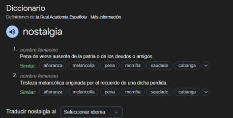
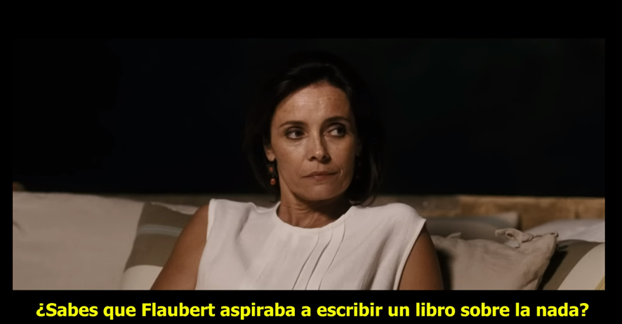
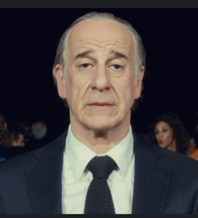
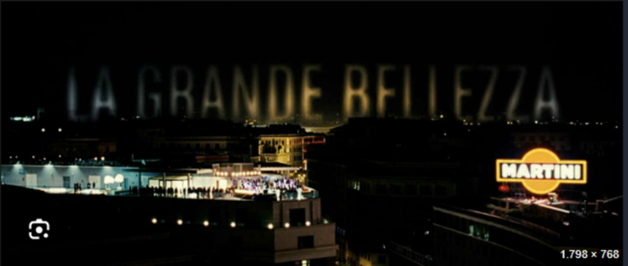

\*\*NOSTALGIA. El arte sobre una emoción inexistente/irreal.

Harán ya 6 años de aquella noche en Cartagena, cuando vi por primera vez, esa pieza de arte. Siendo sincero, en ese momento, no sabía que estaba viendo, no entendía las motivaciones del protagonista y el mundo en el que se movía este hombre mayor que se parece a goofy y pluto juntos y claramente algo torturado, no parecía haber sido escrito con mucho detalle o interés.

Recuerdo reconocer Roma, con su divina forma y luz, pero de verás que poco más. No recuerdo llevarme nada de esa película, más que el ejercicio que mi cerebro hizo por su cuenta de almacenar una tarde más con mi padre y mis hermanos en Cartagena.

Varios años más tarde, vi una película super mega indie, seguro que no la conocéis, llamada “La La Land”. De primeras, me pareció una masterclwass, pues de todo lo que una historia bien contada “debe” tener, ¿no? Dos de los protagonistas más carismáticos que había visto, por supuesto de la mano las actuaciones de los actores.

La oda a la música que supone, el maravilloso uso del color, el ritmo liderado por el grandísimo director. Además, de la idea sobre la importancia de la persecución de un sueño y la importancia de rodearte de gente que te motive y el homenaje al cine y la acción creativa como tal.

Pero había algo más, en el reflejo de esa mirada de Emma Stone, algo “flojo/weak”, muy sutil en su actuación. Con esto, estoy seguro de que muchas personas lo detectaron automáticamente. Pero se ve que me cegó las dimensiones de la peli para fijarme en algo tan débil en las primeras horas después de verla.

Creo que a lo que me refería era la nostalgia, esa minúscula pero inescapable sensación.

Esa misma noche, tumbado en la cama, estaba un poco atormentado por el pensamiento de querer entender lo que había visto, me preguntaba:

¿Qué partes de la película son más o menos nostálgicas?, si no escenas especificas ¿Qué apartado como el color, la música o las actuaciones lo eran?¿Puede ser algo, intrínsecamente nostálgico o es dependiente del observador?¿Tenía ni siquiera intención el director de plasmar esta emoción?, es decir, ¿me lo había imaginado?

Encontré ciertos aspectos que se podrían relacionar más o menos claramente con la nostalgia, pero,

¿tampoco sabía qué era exactamente a lo que me refiería con nostalgia?

De las primeras medio respuestas que me podía dar eran analíticas / científicas.

¿Por qué tuve una respuesta nostálgica?¿Por qué existe esta sensación, esta emoción? Pues no parece tener un valor biológico. No parece haber dado una ventaja genética a lo largo del tiempo.

Sin embargo, todos la tenemos. Todos lo hemos sufrido o disfrutado.

Luego la intente entender, pero me tope con que, busques la clasificación que busques, no la ves en ninguna clasificación clásica de sentimientos. No encaja en ninguna categoría de ninguna rueda de emociones.

No se asemeja necesariamente a una emoción alegre, o triste, o de ira.  

Escapa también de la definición de la RAE:

Ósea, cada vez que la quería “entender” o “ver” o “definir” esta sensación, más se me escapaba, como un animal que encuentra la manera de huir de cualquier celda, casi como algo líquido que de forma natural cae por la superficie de menor resistencia y pendiente.

Porque la sentí, ósea no hay duda, que aquello que sentí al salir de ver “La La Land” era algo más que una brutal historia de amor, no. Había algo un poco menos necesariamente real o material, pero espolvoreado claramente a lo largo de la película.

Pero pensándolo mejor, no es una emoción totalmente libre, pensé a mí mismo, ¿cierto? Está atada al pasado, pues no se podría tener nostalgia del futuro, ¿no?

Esto me dio cierta calma, pues era algo que al menos parecía estar acotado por al menos un ángulo, por lo que mi mente la podía al menos comenzar a categorizar.

Esto me sirvió para apaciguar al menos a mi cabeza esa noche.

**EDWARD HOPPER. La nostalgia como respuesta al presente. (A un presente que te pasa por delante)**

Al pintor americano, Edward Hopper se le suele adueñar a sus cuadros la sensación general de soledad, de distancia entre tu y tu entorno, cierto desarraigo de la población americana que pintaba, con un país que había pasado por dos guerras mundiales y todo el cambio que eso llevaba.

Las personas de sus cuadros, casi nunca cruzan sus miradas y si lo hacen no parece que se miren realmente a los ojos, están siempre un poco desalineadas. Como que todos se sienten solos, aunque estén juntos.

Pero quizás la palabra que mejor describe muchas de sus obras no sería tanto la de la soledad, sino la de la **nostalgia**. Porque, aunque efectivamente la mayoría de los escenarios son solemnes y aparentemente desolados, tanto por la mera cantidad de personas que aparecen en ellos, como el uso del contraste de la luz y las situaciones ordinarias que pinta.

La sensación que me llevo al verlos, sobre todo desde el punto de vista de la intención de Hopper, habiendo leído un poco sobre él, no era sobre la soledad. Ya que, al menos por lo que se le recuerda, era un hombre, que, aunque tímido, no parecía recluirse o haber sido recluido.

No, la sensación que me deja es la de intentar captar instantes ya sean de personas y/o espacios, que parecían estar siendo devorados por el tiempo, por un cambio rapidísimo tanto en modo de vida, como de ideología. La intención me parece que el intento de volver a un pasado que entendían, del que se sentían parte. De alguna manera que podían sostener en su mano pues parecía domable y manejable.???

Estas las miradas son la de personas que intentan agarrarse a rocas en un río y al estar mareados por estar en él durante varias décadas, ya no entienden las direcciones de su corriente.

Quizá, por eso no pintaba muchas cosas, es decir, no sobrecargaba, pues él quería tener al menos bajo “control” sus cuadros. Una manera de escapar del abrumador estado de todo lo que les rodeaba.

También creo que estas dos palabras no son excluyentes, a lo mejor la soledad es parte de la nostalgia, quizás no necesariamente debes estar solo para sentirla.

Pero cuando tienes este viaje nostálgico, ese momento de viaje al pasado, vives una experiencia alienadora o, “fría”, en el sentido de sentirse solo en un bosque de noche en el presente, en comparación con el pasado que recuerdas y ahí hay cierta soledad.

Creo que la soledad es una de los componentes, sin duda, de sus composiciones. Pero me parece que me dicen algo más que eso, que todos los componentes de sus cuadros, se juntan en algo mucho más grande y realmente imposible de poner en palabras, pues se escapa de todas las jaulas, menos la del tiempo, como es la **NOSTALGIA**.

Pero tenéis razón, esas miradas no se parece a nada a la que tuvieron Mia y Seb en LaLaLand.

¿Pero, porque no? Porque creo que entre Mia y Seb, y aquí entra la grandeza de esa escena y algo que no hubiese podido diferenciar antes de hacer este video, pero ahora veo claramente, entre ellos no hay nostalgía, hay algo mucho más devastador, hay melancolía.

Quizás una hermana de la nostalgia, pero con una diferencia fundamental, la melancolía está arraigada en el revolverse en un pasado que jamás ocurrió. Es un vicio irreal. Se basa en un deseo muerto, es fundamentalmente infértil. Por eso, ese momento dentro del Seb’s es mucho más doloroso y uno de mis momentos favoritos del cine.

Sin embargo, la nostalgia es fértil, palpita con vida, pues se basa en algo que por cruel que sea, al menos sucedió y puedes llorar y aprender de ello o gozar de ello, algo que con la melancolía no.

**¿Vosotros también la notáis?, ¿no?**

**LA GRANDE BELLEZA – La aceptación de la nostalgia como modo de vida. (La nostalgia a un pasado inalcanzable)**

Fue solo hasta 2024 que pude convencer a mis compañeros de piso para ver una peli que yo creía que va a ser muy especial, por supuesto una peli que nunca había visto, pero de la cual había odio maravillas. Por parte de mi círculo cercano, también de Rigoberta Bandini y Ctangana y del gran ensayista Jordi Maquiavello.

Nos decidimos en ver la pelí por fin, yo con unas ganas terribles de por fin ver y quizás entender los altísimos calificativos que había escuchado al oír describirla. Y fue entonces, cuando mi cerebro me volvió a jugar una mala pasada. No podía creerlo, me cabeza llena a la vez intentando captar lo que estaba viendo mis ojos presentes y lo que vieron mis ojos pasados.  
Esa película no era nueva para mí. Recuerdos me revoloteaban con cada corte.

Esta era la película que vi aquel día con mi padre hace ya tantos años. Al darme cuenta por completo que efectivamente aquella era, me invadió un sentimiento de añoranza a aquel día de verano. Lo recordaba todo, ya había llegado la nostalgia.

Escena de charla de Romano, sobre la nostalgía.

Y me embarque, en la que considero la mejor experiencia que he tenido viendo una obra de arte. No recordar haber visto esa película, es decir, permitiendo a mi cerebro entender el motivo nostálgico troncal de la peli, mientras me acordaba nostálgicamente de cuando la vi por primera vez, me multiplicó la experiencia a niveles que nunca había conocido y lo que me hace estar muy agradecido por esta “casualidad”.

Pero al terminarla que lo entendí todo, si ya era horrible tener que combatir una nostalgía de un pasado cercano o de incluso un presente como hizo Hopper o de una melancolía romántica como Ryan y Emma.  
Fue solo gracias a Paulo Sorretino, por el que pude ver la verdadera influencia de la nostalgía.

El arte sobre la nada,

Normal que no entendiera nada la primera vez que la vi, con esos ojos jóvenes, insensibles a la nostalgía. ¡No había vivido lo suficiente para tenerla¡ Normal que no me acuerde de nada. Ese día, esa película para mí no iba de nada. El protagonista no era nadie, ninguna era su motivación.

Me hizo ver, eligiendo de forma maestra la ciudad de Roma, con su forma y luz, como ejemplo máximo y extremo de esta sensación. La agonía de la ciudad eterna, eternamente estancada y a la que se le acaba el oxígeno. Hipoxia.

Fue a través de los ojos de Jep Gambardella, que pude ver qué ocurre cuando tu contexto histórico no te deja avanzar después de ciertos momentos cúlmenes de tu “contexto”. Estas acotado por tu historia, por cosas que ves (Panteón), sabes (Escene del sarmiento a la mujer) o sientes (Jep llorando o quieto en la fiesta).

Ciertos delirios de una nostálgica grandeza, que te queda muy grande, que nunca podrás superar y cuya única solución es aceptar tu pequeño papel apaciguando tu mente dejándote caer en la miseria que te rodea,

pero que al mismo tiempo te recuerda constantemente lo lejos que estas de encontrar eso que más buscas.

LA GRANDE BELLEZA. Plano del título.

LaLaLand, es mi historia de amor favorita, porque, a pesar de su final, ahora entiendo que es al ser nostálgica es intrínsecamente hermosa, positiva y enriquecedora, porque lo has vivido.

Los cuadros de Hopper, no me entristecen, me calman. Me dicen que hubo alguien observador y sensible, capaz como pocos en captar esta sensación en definición incapturable.

Y la grande belleza, me inspira como ninguna otra obra, en el sentido más estricto de la palabra, a seguir viviendo.

Lo que me hace pensar que la propia naturaleza de la nostalgía la hace imposible de definir en el presente. Mires como lo mires, no estás en el momento de entenderla, necesitas tiempo. ¿Como criticarías un libro o un álbum antes de leerlo o escucharlo?. Pues lo mismo, con la vida misma.

Esta conclusión es un pelín agridulce, ya que aunque es cierto que me La grande Belleza me ha enseñado a valorar el paso del tiempo, el valor positivo inigualable de la nostalgía y al estar en constante búsqueda de aquello lo que impregna todo. Además, de todo lo antes mencionado sobre los artistas nombrados en este video. Sin embargo, a la vez, nos recuerda su naturaleza inescapablemente cíclica, esto es, temo decir, **que no hay futuro sin nostalgia, se me ha vuelto a escapar.**

[https://www.youtube.com/watch?v=QRjorGBwzzc](https://www.youtube.com/watch?v=QRjorGBwzzc)

**FIN**
